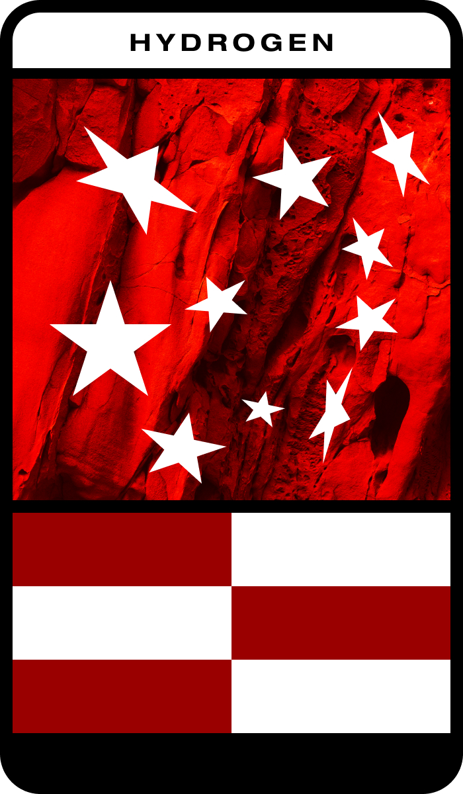

# Blog Post #02 - AR PROJECT IDEA & INITIAL STEPS
### Author: Viktor Ivaylov Ivanov

## The Big Idea: Gamifying Chemistry
The main goal of this project is to explore how Augmented Reality can be used as a learning and engaging tool for Chemistry, specifically for understaning chemical elements and how they form molecules. 

The core idea is to design a collectible card-based system, similar to how trading cards work. Each physical card represents a chemical element (e.g. Hydrogen or Oxygen). When a user places a card on a table and views it through the AR appication, a 3D model of the corresponding atom appears.

The real interaction begins when multiple cards are placed next to each other, which the application then detects if it's a valid combination and shows the 3D model for the molecule. This allows the user to experiment freely and visually observe as their physical actions with the cards transform into different molecules. 

## Technical Stack:
One of the first and most important decisions for the project was choosing the right development tools. Unity was selected as the game engine due to my prior experience with it as it allowed me to focus more on experimentation with AR rather than learning a new environment.

Furthermore, Unity's AR Foundation was chosen as the core framework. It provides a unified way to implement the features required for the project, such as image tracking, making it possible to detect the physical element cards.

In addition to development tools, Figma was used to design the physical cards and Vuforia's Target system was used to rate how augmentable the created cards were.

## Making of the Cards
For the image tracking to actually work, the physical cards had to have a strong and distinctive visual features that can be easily detected by teh camera. In practice, this means each card must have hiugh contrast and sufficient amount of unique visual detail when compared to its surroundings.

Image tracking systems such as those used by AR Foundation rely on feature point detection, which mean I had to have small, high-contrast visual patterns (edges, corners, and texture variations) that can be consistently recognized from different angles and lighting conditions.

To address this, the card designs were intentionally created with:

- High contrast between foreground and background elements
- Distinct textures and shapes rather than large flat color regions
- Visual randomness, helping the tracking system find enough unique feature points
- Clear element identity, ensuring the card remains readable and recognizable to the user

In the end, three element cards were designed following these principles. An example of the Hydrogen card design is shown below, demonstrating the balance between visual complexity and readability required for effective AR image tracking.

Image includes:

- Name for the user
- High-contrast, singular color texture for background.
- Shapes (in this case stars) for better image tracking.
- Customized unique shape (the chequered part)